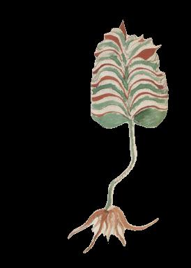
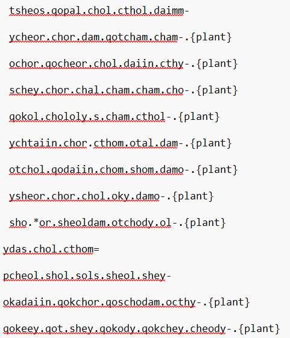
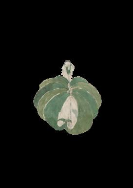
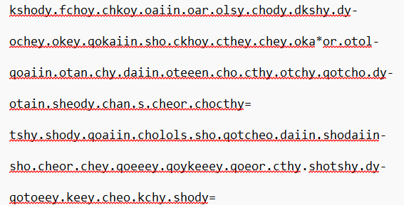

---
# Feel free to add content and custom Front Matter to this file.
# To modify the layout, see https://jekyllrb.com/docs/themes/#overriding-theme-defaults

layout: default
---

## Description

These are images that have been extracted from the voynich manuscript. This manuscript is a book containing strange images and an unknown language. By associating certain characters from the manuscript with letters of the alphabet, it is possible to train an AI model to generate images based on some english characters given to the model.
Below are 2 examples of a text file and an extracted image. There are a total of 65 extracted images and 65 text files that are contained in this github [repository](https://github.com/MRLEMONHEAD1234/Voynich-Manuscript).

Author: Alex Shen

## Gallery
Page 7 : 

Page 11: 

:  
Credits:Takeshi Takahashi, Jorge Stolfi, and Gabriel Landini

